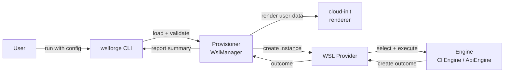

# ⚒️ wslforge

## 🔎 Overview

A minimal tool to declaratively create and manage WSL instances.

<!-- markdownlint-disable-next-line MD033 -->


### WSL instance manager

[](LICENSE)
[](https://github.com/mirai-toto/wslforge/actions/workflows/build.yml)
[](https://github.com/mirai-toto/wslforge/releases)
[](https://www.rust-lang.org/)

✨ A clean, declarative way to create WSL instances from a single YAML config, with a focus on clarity and repeatability.

`wslforge` does two things:

1. **Manages WSL instances** — creates, configures, and optionally replaces instances from a YAML profile.
2. **Templates cloud-init user-data with Jinja** — your `cloud-init` content (file or inline) is rendered as a [Jinja](https://jinja.palletsprojects.com/) template before being handed to WSL, giving you variables, conditionals, and filters inside your user-data.

> Status: early/in-development. Some operations are still mock.

---

## 🧱 Architecture

At a high level, the CLI orchestrates provisioning from your config, prepares `cloud-init`, then delegates WSL instance creation to a pluggable engine.

Flow:

1. `wslforge` CLI loads and validates the config file.
2. The provisioner (`WslManager`) prepares the profile by validating image source and environment, then rendering and writing the `cloud-init` user-data file (or logging it in `dry-run`). User-data content is rendered as a Jinja template using profile values as context variables.
3. The provisioner calls the WSL provider, which selects an engine: `CliEngine` for the `wsl.exe`-based flow or `ApiEngine` for the WSL API flow.
4. The engine creates the instance and reporting summarizes outcomes.

This keeps the core provisioning logic stable while allowing the underlying WSL implementation to evolve independently.



## ✅ Requirements

WSL must be enabled on Windows before you can create instances. Run this once in an elevated PowerShell:

```powershell
Enable-WindowsOptionalFeature -Online -FeatureName Microsoft-Windows-Subsystem-Linux
```

Optional: install the latest PowerShell via winget if you prefer a newer shell experience:

```powershell
winget install --id Microsoft.PowerShell --source winget
```

---

## ⚡ Quickstart

Download the latest release binary from: [Releases page](https://github.com/mirai-toto/wslforge/releases) 📦

```sh
curl -L -o wslforge.exe https://github.com/mirai-toto/wslforge/releases/download/v1.8.0/wslforge.exe
```

Run it with your config: ✅

```sh
./wslforge --config config.yaml
```

Want to preview what will happen without making changes? Use dry-run: 🔍

```sh
./wslforge --config config.yaml --dry-run
```

Need more details for troubleshooting? Increase verbosity: 🧰

```sh
./wslforge -v
./wslforge -vv
```

---

## 🧭 CLI

Common flags:

| Flag             | Description                             | Default       |
| ---------------- | --------------------------------------- | ------------- |
| `--config`       | Path to YAML config file                | `config.yaml` |
| `--dry-run`      | Show what would be done without changes | `false`       |
| `--debug`        | Enable extra debug output and write artifacts to the current directory (e.g. `cloud-init.<hostname>.user-data`) | `false`       |
| `--print-example-config` | Print a minimal example config and exit | `false`       |
| `-v`, `-vv`      | Increase verbosity                      | `0`           |

Print a minimal example config:

```sh
./wslforge --print-example-config
```

---

## 🛠 Development

Build locally:

```sh
cargo build --release
cp config.template.yaml config.yaml
./target/release/wslforge --config config.yaml
```

Enable the repo githooks and make the hook executable:

```sh
chmod +x .githooks/pre-commit
git config core.hooksPath .githooks
```

The pre-commit hook runs `cargo fmt --all`, `cargo clippy --all-targets --all-features -- -D warnings`, `cargo check --all-targets --all-features`, and `cargo test --all-features`.

You can run CI checks locally before pushing:

```sh
# Default checks (Docker target: ci-core)
./scripts/run-local-ci.sh

# Extended checks (Docker target: ci-all)
./scripts/run-local-ci.sh --all
```

Container prerequisite: `docker`.

All check logic lives in `scripts/ci-local.Dockerfile`. If the image build succeeds, checks passed.
Intermediate targets are available for focused runs: `ci-rust-matrix`, `ci-rust-quality`, `ci-markdown`, `ci-typos`, `ci-security-audit`, `ci-coverage`, `ci-semantic-release`.

---

## 🧩 Configuration

The configuration is intentionally small. All fields are optional and have sensible defaults, so you can start with a minimal config and grow into advanced options as needed.

The top-level config is an `instances` map, where each key is an instance name:

```yaml
instances:
  MyInstance:
    hostname: MyInstance
    username: wsluser
```

Note: a bare instance object at the root (without `instances:`) is still accepted for backward compatibility, but the recommended format is the `instances` map.

Core fields (per instance):

| Field              | Description                               | Example                   | Default             |
| ------------------ | ----------------------------------------- | ------------------------- | ------------------- |
| `override`         | Replace existing instance if it exists    | `true`                    | `false`             |
| `hostname`         | WSL instance name                         | `UbuntuWslDev`            | `UbuntuWSL`         |
| `username`         | Default user                              | `wsluser`                 | `wsluser`           |
| `password`         | Optional password (hashed for cloud-init) | `root`                    | —                   |
| `install_dir`      | Target install directory                  | `%userprofile%/VMs`       | `%userprofile%/VMs` |
| `proxy.http`       | HTTP proxy URL                            | `http://proxy.local:8080` | —                   |
| `proxy.https`      | HTTPS proxy URL                           | `http://proxy.local:8080` | —                   |
| `proxy.no_proxy`   | Comma-separated proxy bypass list         | `localhost,127.0.0.1`     | —                   |

Related sections:

- [🐧 Image source section](#image-sources)
- [☁️ Cloud init section](#cloud-init)

Example `config.yaml` with a file-based cloud-init and an official distro:

```yaml
instances:
  UbuntuWslDev:
    override: true
    hostname: UbuntuWslDev
    username: wsluser
    password: root

    proxy:
      http: http://proxy.local:8080
      https: http://proxy.local:8080
      no_proxy: localhost,127.0.0.1

    install_dir: "%userprofile%/VMs"

    cloud_init:
      type: file
      path: "cloud-init.yaml"

    image:
      type: distro
      name: Ubuntu
```

### Cloud init

Use cloud-init to bootstrap packages and settings on first boot. You can reference a file or embed the YAML inline. These blocks live inside an instance.

Both `file` and `inline` content are rendered as **Jinja templates** before being written as user-data. Instance fields are available as direct template variables (e.g. `{{ username }}`, `{{ hostname }}`), and the hashed password is available as `{{ password_hash }}`. Proxy fields are available as `{{ proxy.http }}`, `{{ proxy.https }}`, `{{ proxy.no_proxy }}`. Custom variables defined under `vars:` are accessible as `{{ vars.my_key }}`.

Cloud-init types:

| Type     | Description                | Example                   |
| -------- | -------------------------- | ------------------------- |
| `file`   | Load user-data from a file | `path: "cloud-init.yaml"` |
| `inline` | Inline YAML user-data      | `content: \| ...`         |

File-based user-data (recommended for larger configs):

```yaml
cloud_init:
  type: file
  path: "cloud-init.yaml"
```

Inline user-data (handy for small, self-contained configs):

```yaml
cloud_init:
  type: inline
  content: |
    #cloud-config
    packages:
      - curl
```

### Image Sources

Pick where the root filesystem comes from: an official WSL distro or a local rootfs archive. These blocks live inside an instance.

Image types:

| Type     | Description                      | Example                               |
| -------- | -------------------------------- | ------------------------------------- |
| `distro` | Install from official WSL distro | `name: Ubuntu`                        |
| `file`   | Import from local rootfs archive | `path: "%USERPROFILE%/Downloads/..."` |

Official WSL distro (simple and quick):

```yaml
image:
  type: distro
  name: Ubuntu
```

Local rootfs archive (for custom or prebuilt images):

```yaml
image:
  type: file
  path: "%USERPROFILE%/Downloads/ubuntu-noble-wsl-amd64-ubuntu.rootfs.tar.gz"
```

---

## 💡 Rationale

### Why this project exists

- Set up WSL the same way every time using one config file
- No more clicking around or doing steps by hand
- Share your setup with others easily
- Recreate your dev environment in minutes
- Break things safely and rebuild fast

### Why it’s written in Rust

Originally prototyped in **PowerShell**, but moved to **Rust** for long-term reliability and maintainability.

- A single executable is easier for users than running and trusting scripts
- Strong typing and solid tooling make the app more reliable as it grows
- Great ecosystem for CLI apps, config parsing, logging, and testing

### Why not use an ISO image

Installing from an ISO is a valid approach — and not only are the two not mutually exclusive, they are actually meant to be used together. The intended workflow combines both: use the profile and cloud-init config to build and configure an instance first, then export the result as a rootfs to use as a versioned base image. The config is the source of truth; the image is the distributable artifact.

Keeping the instance definition as code — a small YAML profile and a cloud-init file — gives you:

- **Reproducibility** — run the same config on any machine and get the same result, with or without a custom base image
- **Transparency** — the full intent of the instance is readable in plain text, not locked inside an opaque image
- **Version control** — track changes to your environment the same way you track changes to application code
- **Composability** — profiles are easy to parameterise, share, and layer using Jinja templating

The relationship mirrors Docker: the config and cloud-init are your Dockerfile, and the ISO is the image snapshot of the result.

### Why it uses cloud-init

Originally provisioned with **Ansible**, but moved to **cloud-init** to better match first-boot, zero-prep environments.

- Simpler model: one config applied automatically at first boot
- Faster path to a ready system since provisioning happens during startup
- No prior network or SSH setup required to begin configuration
- Already included on most modern distros, no extra install step

---

## 📄 License

MIT — see [LICENSE](https://github.com/mirai-toto/wslforge/blob/main/LICENSE).

---

## 🤝 Support

Open an issue at [GitHub Issues](https://github.com/mirai-toto/wslforge/issues) with your logs and config details if possible.

---

## 🔗 Useful Links

- [Cloud-init WSL datasource](https://cloudinit.readthedocs.io/en/latest/topics/datasources/wsl.html) for user-data behavior and file locations
- [WSL documentation](https://learn.microsoft.com/windows/wsl/) for setup, commands, and troubleshooting

---

## 👤 Credits

Made by [mirai-toto](https://github.com/mirai-toto). Thanks for checking it out!

---

## 🙏 Acknowledgements

Thanks to the maintainers of WSL, cloud-init, Docker, k3s, Helm, and wsl-vpnkit.
