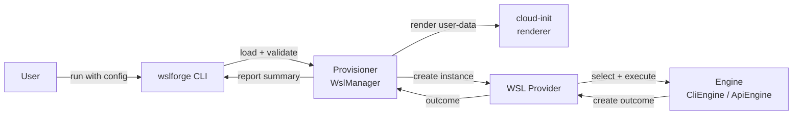

# 🧱 Architecture

At a high level, the CLI orchestrates provisioning from your config, prepares `cloud-init`, then delegates WSL instance creation to a pluggable engine.

## Flow

1. `wslforge` CLI loads and validates the config file.
2. The provisioner (`WslManager`) prepares the profile by validating image source and environment, then rendering and writing the `cloud-init` user-data file (or logging it in `dry-run`). User-data content is rendered as a Jinja template using profile values as context variables.
3. The provisioner calls the WSL provider, which selects an engine: `CliEngine` for the `wsl.exe`-based flow or `ApiEngine` for the WSL API flow.
4. The engine creates the instance.
5. If cloud-init is configured, the provisioner polls `cloud-init status` and waits for provisioning to complete before continuing.
6. File transfers and post-create scripts run after the instance is fully provisioned.
7. Reporting summarizes outcomes.

This keeps the core provisioning logic stable while allowing the underlying WSL implementation to evolve independently.

